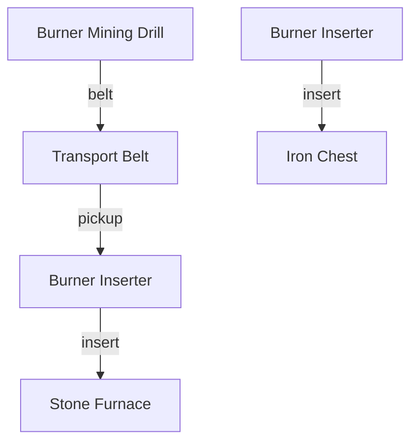

This is an experiment to see whether using the Mermaid graph DSL can help improve composition of complex graphs.

The idea is to map the objective into a graph, and then use the graph to guide the composition of the code.

The objective `Create a copper smelting setup with a furnace and a chest`

Would become:



Which would then be translated into the following code:

```

```